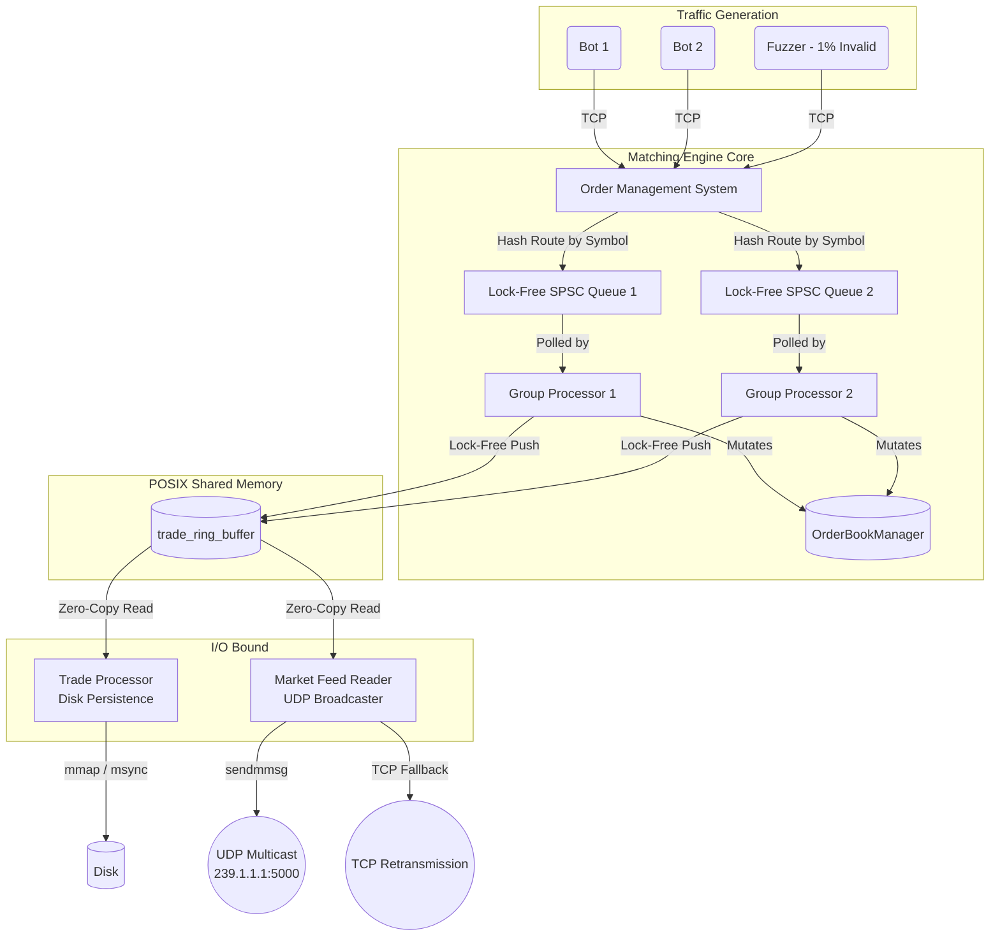

# TradeX: Low Latency Matching Engine

## Overview

TradeX is a ultra-low latency cryptocurrency/equities matching engine engineered for High-Frequency Trading (HFT) environments. Designed to minimize kernel intervention and eliminate thread contention, TradeX relies entirely on lock-free data structures, zero-copy architecture, POSIX shared memory, and batched UDP multicast.

By leveraging strict `std::memory_order` semantics, dedicated SPSC queues, and memory-pinned data structures, TradeX achieves deterministic, microsecond-level order execution while bypassing the OS scheduler on the hot path.

---

# System Architecture & Data Flow

<p align="center">
  
</p>

TradeX is divided into four decoupled, specialized microservices. This separation of concerns ensures that the critical path (order matching) remains completely isolated from I/O-bound tasks such as disk persistence and network broadcasting.



---

# Components

## 1. Pipeline Server (OMS & Matching Engine)

The brain of TradeX.

The Pipeline Server listens for incoming TCP connections, normalizes raw client bytes into structured `Order` objects via the Order Management System (OMS), and manages active client sessions.

### OMS & Routing

- Validates advanced order types:
  - Iceberg
  - Stop-Loss
  - Market
  - Limit
- Deterministically routes valid orders to a consumer thread using a bitwise hash of the `symbol_id`.

### Lock-Free Dispatch

Orders are pushed into group-specific `spsc_queue` (Single Producer Single Consumer) ring buffers using atomic acquire/release memory ordering.

This provides:

- Zero lock contention
- Wait-free producer
- Cache-friendly communication

### Group Processors

Dedicated CPU-pinned threads continuously spin-poll their assigned SPSC queue.

Each processor matches orders against an `OrderBookManager`.

Order books are stored using:

```cpp
std::vector<std::unique_ptr<OrderBook>>
```

to guarantee pointer stability during vector reallocations.

### Trade Publication

Completed trades are immediately pushed into the shared `trade_ring_buffer`, which serves as the IPC bridge to downstream microservices.

---

## 2. Trade Processor (Disk Persistence)

The Trade Processor is an independent consumer responsible solely for durability.

It memory maps the shared `trade_ring_buffer` and asynchronously persists trades to disk.

### Pre-allocation

To eliminate latency spikes caused by lazy page allocation, TradeX uses:

```cpp
posix_fallocate()
```

before trading begins.

### Circular Buffer of Buffers

Trades are persisted using a nested ring-buffer architecture.

Persistence occurs through:

- `mmap()`
- asynchronous `msync()`

allowing disk writes without blocking the matching engine.

---

## 3. Market Feed Reader (UDP Broadcaster)

Responsible for disseminating real-time market data.

### UDP Multicast

Consumes trades directly from shared memory.

Uses Linux's

```cpp
sendmmsg()
```

system call to batch multiple UDP packets into a single kernel transition.

### TCP Retransmission

Since UDP is lossy, the Market Feed Reader maintains a secondary non-blocking TCP connection.

Clients may request missing sequence numbers, which are retransmitted without interrupting the multicast path.

---

## 4. Remote Bots (Traffic Generator & Fuzzer)

Used for benchmarking and resilience testing.

### Traffic Flooding

Generates tens of thousands of orders per second across multiple concurrent TCP connections.

### Deterministic Chaos

Injects approximately **1% intentionally invalid orders**, including:

- zero prices
- invalid symbols
- malformed Iceberg orders

This validates:

- boundary checking
- arithmetic underflow protection
- queue correctness
- resistance to backpressure deadlocks
- prevention of phantom book sweeps

---

# Key Technical Achievements

## Zero-Lock Hot Path

The critical matching pipeline uses **no**:

- `std::mutex`
- `std::lock_guard`

Synchronization relies exclusively on cache-coherent atomic operations.

---

## Custom Memory Pools

OrderBook nodes are allocated from pre-allocated memory pools.

Benefits include:

- no runtime `new/delete`
- no heap fragmentation
- reduced allocator overhead
- deterministic latency

---

## Zero-Copy IPC

Microservices communicate exclusively through POSIX shared memory (`mmap`).

Trades are never serialized or copied between:

- Matching Engine
- Trade Processor
- Market Feed Reader

---

## Fault Tolerance

The engine silently discards malformed messages and invalid market sweeps while allowing Group Processor spin loops to continue uninterrupted.

---

# Getting Started

## Prerequisites

- **Operating System:** Linux (Ubuntu/Debian recommended)
- **Compiler:** GCC/G++ 10+ with C++20 support
- **Libraries:**
  - Abseil
  - `librt`
  - `pthread`

---

## Build

TradeX includes a build script that compiles all microservices.

```bash
chmod +x build.sh
./build.sh
```

---

## Run

The runtime environment depends on proper startup ordering and multicast configuration.

```bash
chmod +x run_tradex.sh
sudo ./run_tradex.sh
```

> **Note:** `sudo` may be required to configure the UDP multicast route (`239.1.1.1`) and create POSIX shared memory mappings under `/dev/shm`, depending on system policies.

---

# Project Structure

```text
TradeX/
├── bots/                  # Traffic generator and fuzzing implementation
│   ├── run.cpp
│   └── symbols.csv
│
├── data/                  # Normalized instrument reference data
│   └── symbols.csv
│
├── include/               # Core headers
│   ├── oms.h
│   ├── order_book.h
│   ├── spsc_queue.h
│   ├── trade_ring_buffer.h
│   └── ...
│
├── src/                   # Microservice implementations
│   ├── oms.cpp
│   ├── producer_consumer.cpp
│   ├── live_tp.cpp        # Trade Processor
│   ├── live_mfr.cpp       # Market Feed Reader
│   └── ...
│
├── tests/                 # Benchmarks and tests
│   ├── benchmark.cpp
│   └── write_speed_test.cpp
│
├── build.sh               # Build script
└── run_tradex.sh          # Runtime orchestration
```
